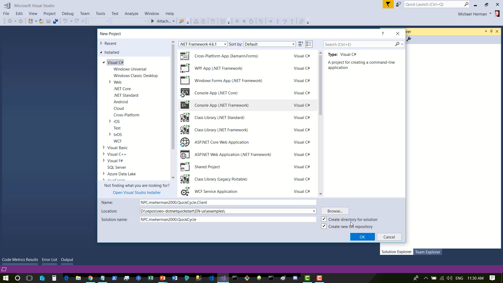
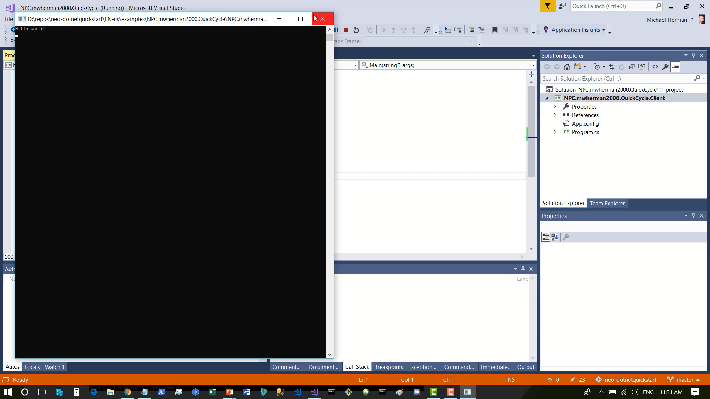
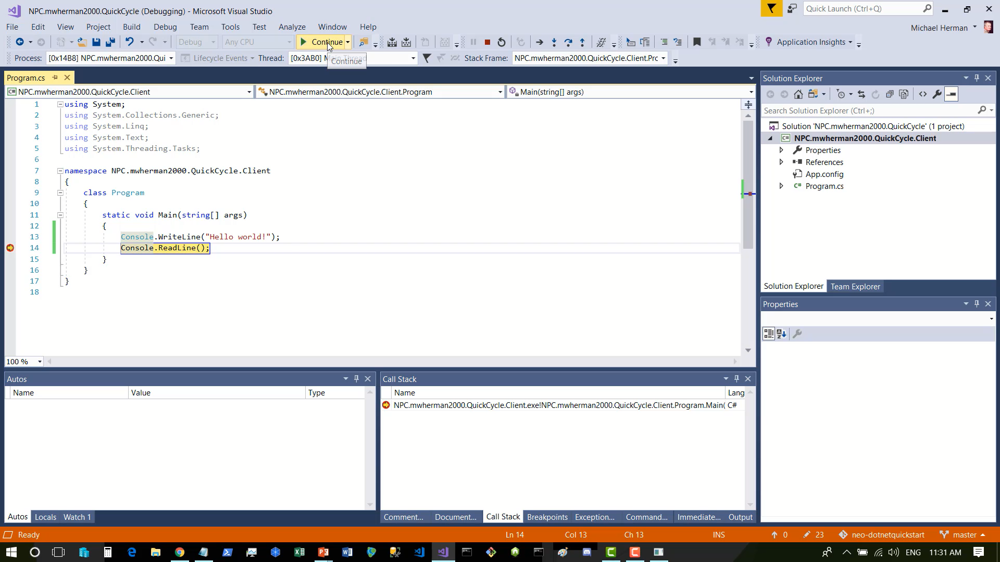
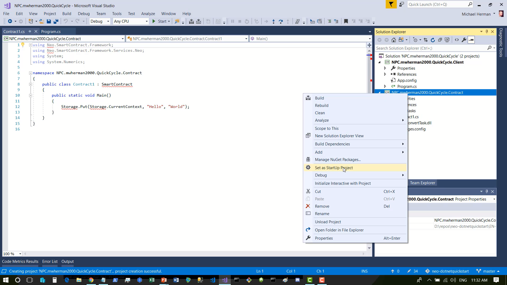
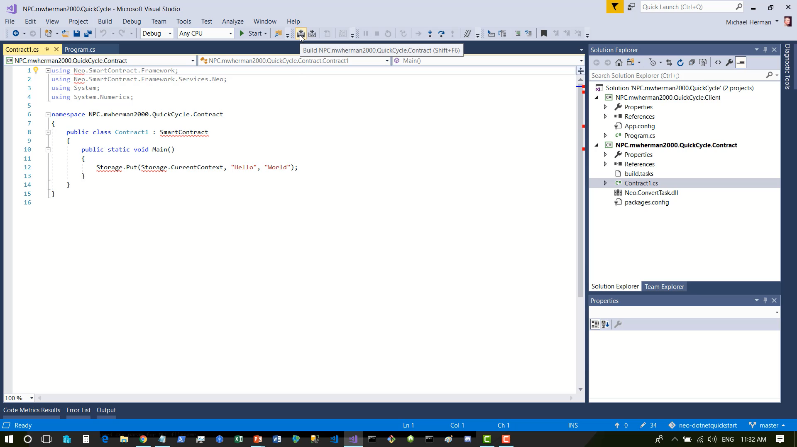
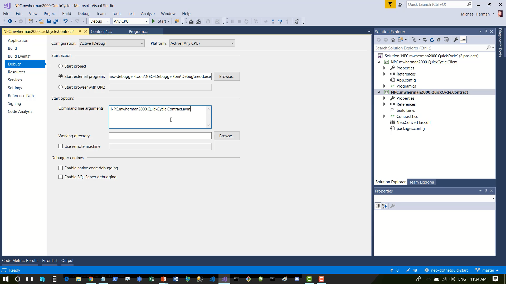
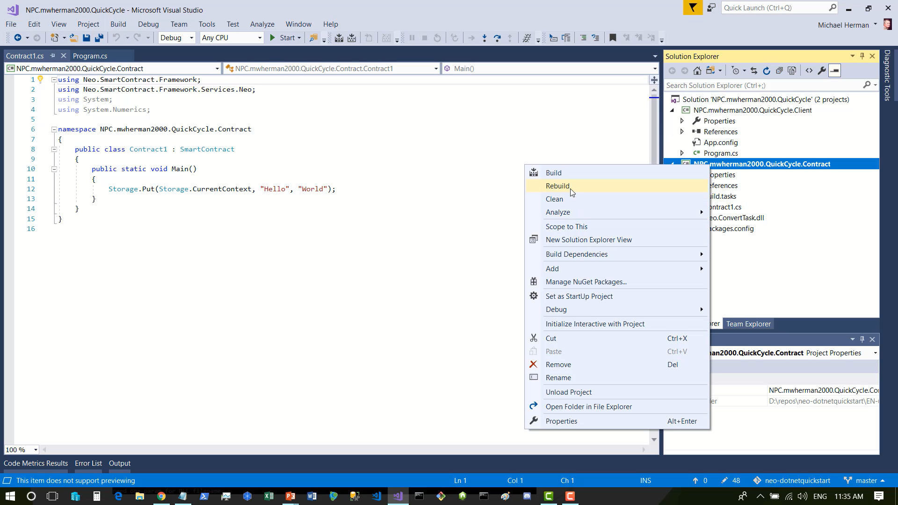
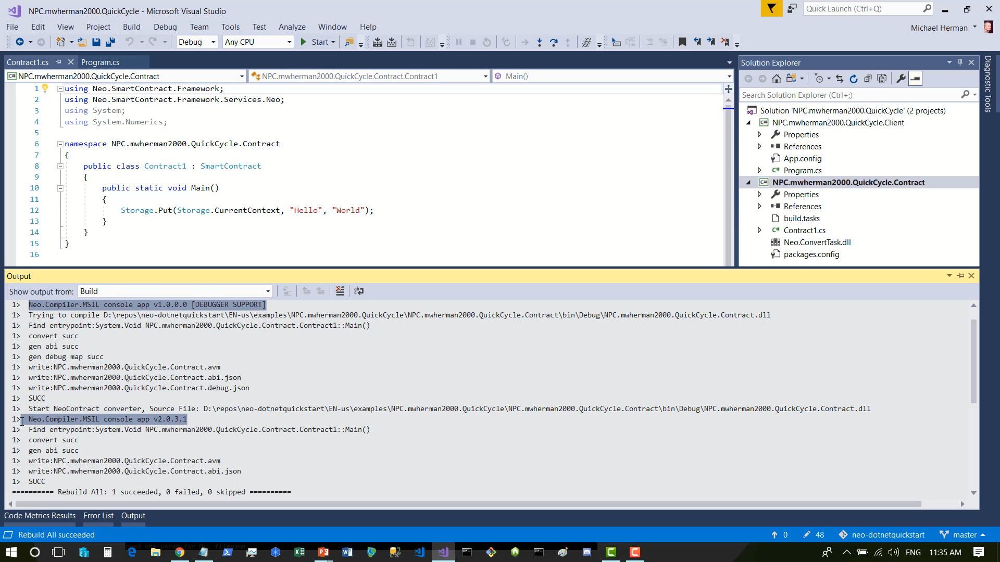

# NEO Blockchain Quick Start Guide for .NET Developers

[NEO Blockchain C# Developers Center of Excellence](https://github.com/mwherman2000/neo-csharpcoe/blob/master/README.md)

The `neo-csharpcoe` project is an "umbrella" project for several initiatives related to providing tools and libraries (code), frameworks, how-to documentation, and best practices for enterprise application development using .NET/C#, C#.NEO and the NEO Blockchain software platform.

The `neo-csharpcoe` is an independent, free, open source project that is 100% community-supported by people like yourself through your contributions of time, energy, passion, promotion, and donations.  

To learn more about contributing to the `neo-csharpcoe`, click [here](https://github.com/mwherman2000/neo-csharpcoe/blob/master/CONTRIBUTE.md).

## Activity 11 - Quick Cycle Edit-Compile-Debugging of C#.NEO Smart Contracts

### Purpose

The purpose of this activity is to demonstrate how to use Visual Studio to rapidly edit, compile and debug C#.NEO smart contracts.

### Goals, Non-Goals and Assumptions

* To reduce the time for your edit-compile-debug cycles to as short as possible.

* Assumptions
  * Your NEO development environment was setup by following the previous activities 0-10 in the [NEO Blockchain Quick Start Guide for .NET Developers](https://github.com/mwherman2000/neo-dotnetquickstart/blob/master/README.md). This activity assumes you have an environment that conforms with the Quick Start Guide. 
  * In particular, this activity is based on the following assumptions:
    * Visual Studio 2017 Community Edition has been installed
    * NeoContractPlugin Visual Studio Extension has been installed
    * Neo-compiler (neon.exe) (debugger version) is installed here:
        ```
        C:\repos\neo-debugger-tools\NEO-Compiler\bin\Debug
        ```
    * Neo-debugger is installed here: 
        ```
        C:\repos\neo-debugger-tools\NEO-Debugger\bin\Debug
        ```
    * Neo-compiler (neon.exe) (regular version) is part of your search `PATH` environment variable

### Principles

* Provide reliable documentation: timely, accurate, visual, and complete
* Save as much of a person's time as possible
* Use open source software whenever possible

### Drivers

* Need in the NEO .NET developer community to have concise and easy-to-follow documentation to enable people to get up to speed developing NEO smart contracts in as short a time as possible

## Quick Cycle Edit-Compile-Debugging of C#.NEO Smart Contracts: Video Tutorial

This is a tutorial intended for experienced .NET/C#/Visual Studio developers as well as those that are new to the platform. 12:28 minutes

[](https://www.youtube.com/watch?v=cXBzuuve36Q) 

## Quick Cycle Edit-Compile-Debugging of C#.NEO Smart Contracts: Task-by-Task Tutorial

### Creating and debugging a conventional Windows console application

1. Open Visual Studio. Select `File` -> `New` -> `Project...` in Visual Studio.

    

2. Select `Visual C#` -> `Console App (.NET Framework)`. Enter a project name (e.g. `NPC.yourname.QuickCycle.Client` is recommended). Remove `.Client` from the solution name. Click `OK` to create the solution and initial Windows console app project.

    

    **NOTE:** In the future, this "Client" Windows console app project becomes the placeholder for the off-chain client/server-side app that invokes the smart contract you'll create in the "Contract" smart contract project.

3. Add the following statements to the `Main` method:

    ```csharp
    Console.WriteLine("Hello world!");
    Console.ReadLine();
    ```
    Click `Start` to compile and debug your console application.

    

4. The phrase `Hello World!` should appear in a console window. Press `Enter` or click the red `X` to close the window and return to Visual Studio.

    

5. Set a breakpoint on the `Console.ReadLine();` statement by clicking in the light-blue margin on the left. Click `Start` to compile and debug your console application a second time. Wen your console app stops at the breakpoint, click `Continue` to resume. Press `Enter` or click the red `X` to close the window and return to Visual Studio.

    

### Creating a C#.NEO smart contract and setting it up for debugging

6. Add a NEO smart contract project to this solution by right-clicking on the solution name in Solution Explorer in Visual Studio and select `Add` -> `New Project...`.

    

7. Select `Visual C#` -> `NeoContract`. Enter a project name (e.g. `NPC.yourname.QuickCycle.Contract` is recommended). Click `OK` to create NEO smart contract project.

    

8. Right-click on the `NPC.yourname.QuickCycle.Contract` project in Solution Explorer and select `Set as Startup Project` to make the smart contract project the default project in the solution.

    

9. Click the `Build project` or `Build solution` icon on the Visual Studio toolbar. (Alternatively, you can right-click on the project in Solution Explorer and select `Build` or `Rebuild`).

    

10. Note in the Output panel in the lower-left corner Visual Studio that your smart contract was built and the NEO VM byte code (.AVM) file was created by the default (non-debugger) version of the NEO compiler (`neon.exe`).

    

11. To update the project settings to use the debugger version of the NEO compiler and to configure the NEO debugger to be launched when you click `Start`, right-click on the `NPC.yourname.QuickCycle.Contract`project in Solution Explorer and select `Properties`.

    

12. Two sets of project properties need to be updateC: `Build Events` and `Debug`. 

      Click on the `Build Events` tab. In the `Post-build event command line` text box, pre-append the path where the debugger-version of the NEO Compiler executable (`neon.exe`) can be found to `%PATH%` and then invoke the compiler passing it the value of the Visual Studio `$(TargetPath)` environment variable:

      ```
      set PATH="C:\repos\neo-debugger-tools\NEO-Compiler\bin\Debug";%PATH%
      neon.exe $(TargetPath)
      ```
    

13. Click on the `Debug` tab. Click the `Start external program` radio button. In the `Start external program` text box, enter the full path name for the NEO debugger executable (`neod.exe`):

      ```
      C:\repos\neo-debugger-tools\NEO-Debugger\bin\Debug\neod.exe
      ```

    

14. In the `Command line arguments` text box, enter the name of the name of your smart contract project concatenated with `.avm` (e.g. `NPC.yourname.QuickCycle.Contract.avm`). This the default name that is used by the NEO Compiler during the build process.

    

15. Click the `X` on the project's properties tab to close it.

    

16. Right-click on the smart contract project in Solution Explorer and select `Rebuild`.

    

17. Note that in the `Output` panel, two compilations have been performed as part of the build process: i) the debugger-version of the NEO Compiler ran first followed by ii) the non-debugger version of the NEO Compiler as "post-post-build" step. We need to remove the invocation of the non-debugger version of the NEO compiler.

    

18. Right-click on the project in Solution Explorer and select `Open Folder` in File Explorer`.

    

19. We need to edit the `NPC.yourname.QuickCycle.Contract.csproj` C# project file to remove the post-post-build step. Right-click on the C# project file and open it with a text editor other the Visual Studio (e.g. Notepad or Visual Studio Code).

    

20. Scroll down to the bottom of the C# project file. Select the following lines and click `Delete` or `Backspace` to remove these lines from the C# project file.

    ```xml
    <Target Name="AfterBuild">
        <Message Text="Start NeoContract converter, Source File: $(TargetPath)" Importance="high">
        </Message>
        <ConvertTask DataSource="$(TargetPath)" />
    </Target>
    ```

    

21. Save the file and close the text editor. 

    **NOTE:** If you used Visual Studio Code to edit the C# project file, double-check that you have saved the file before closing Visual Studio Code. Visual Studio Code will save the edited but unsaved file for you.  It doesn't prompt to check if you want to save the file before closing.

    

22. When you return to Visual Studio, the following pop-up dialog box will appear.  Click `Reload` to reload the C# project file.  This will have no effect on your solution other than to remove the post-post-build event.

    

23. Right-click on the smart contract project in Solution Explorer and select `Rebuild`.

    

24. Note in the `Output` panel that the post-post-build event has been removed and only the debugger version of the NEO Compiler was executed.

    

### Debugging your C#.NEO smart contract

25. To finally debug your smart contract, click `Start`.

    

26. The NEO Debugger will be launched. The source code for your smart contract should be visible in the main panel.

    

27. You can either press `F5` to begin execution of your smart contract (without single stepping enabled) or press `F10` to single-step through your contract.

    For this task, press `F10` to single step through your smart contract.

    The following `Invoke Smart Contract` pop-up dialog will appear. Because the `Main` method for this smart contract doesn't accept any parameters and doesn't return any values, simple click `Debug` to start your debugging session.

    

28. Press `F10` to single-step through your smart contract.

    

29. Continue to press `F10` to single-step through your smart contract until it completes and the `Execution finished` pop-up appears. 

    

    **NOTE:** This invocation of your smart contract consumed just of 1 GAS. Most of this was due to the `Storage.Put()` system call.

30. To inspect the contents of the NEO Storage emulator implemented by the NEO Debugger, select `Debug` -> `Storage` on the debugger tool bar.

    

31. The following Storage pop-up dialog will appear.

    **NOTE:** The single key-value pair that appears in the Storage pop-up dialog.

    

32. Click the `X` in the top-right corner of the debugger to close it and return to Visual Studio where you can continue to edit your smart contract project.

33. To resume the edit-compile-debug cycle by simply clicking `Start` in Visual Studio.

## References

* [NEOTUTORIAL] NEO Project, [NEO smart contract tutorial](http://docs.neo.org/en-us/sc/tutorial.html) from [http://docs.neo.org/en-us/sc/tutorial.html](http://docs.neo.org/en-us/sc/tutorial.html)
